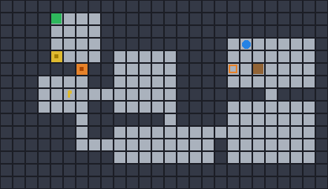
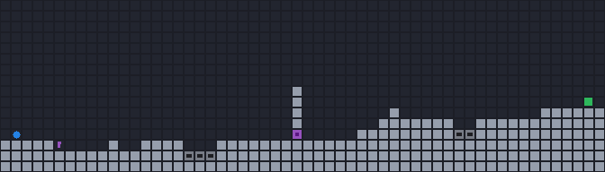

# WorldSmith: text to verified-playable 2D game environments

An agent harness that turns plain-English commands into playable environments in a
custom 2D physics engine, and includes an agent that actually plays them.
No environment ships unless the agent has beaten it inside the engine and the
recorded controller-input trace replays deterministically.

Zero dependencies. Python 3.10+ stdlib only (developed and tested on 3.14).
One optional integration: a command-line LLM, used for language-level
generation and for letting the model play the environments itself. It defaults
to the `claude` CLI and works with any LLM CLI via one environment variable.

```
python3 -m worldsmith run "a dungeon with two locked doors and a lava moat around the goal"
```

Each environment below was generated from the sentence above it, then beaten by
the agent. What you are watching is the agent's recorded button presses,
replayed through the physics engine.

| `"push the crate onto the pressure plate to open the gate"` |
|---|
|  |
| The agent fetches the yellow key, opens the yellow door, shoves the brown crate onto the orange pressure plate (which unlocks the orange gate), then walks to the green goal. The blue disc is the player. |

| `"a long platformer with a locked door and treacherous gaps"` |
|---|
|  |
| Gravity mode: the agent jumps the spike pits, collects the purple key, opens the purple door blocking the pillar, and continues to the goal. Every jump was planned by simulating the engine itself. |

<sub>Both GIFs are written by WorldSmith. Every run emits one, from a
from-scratch GIF encoder (LZW plus frame differencing) in about 120 lines of
stdlib Python. The 171 frames of the first one cost 16 KB.</sub>

```text
  text command ──► brain ──► GenPlan ──► procgen ──► Scene (JSON) ─┐
                (rules | llm)               ▲                      ▼
                                            │            solver agent plays it
                                     reseed & retry ◄──  in the physics engine
                                                                   │ success
                                                                   ▼
                              spec.json · trace.json · result.json · replay.html · replay.gif · scene.png
```

### Reviewing this in five minutes?

Reviewing through a coding agent (Claude Code, Codex, or similar)? The repo
carries agent instructions in `AGENTS.md`; ask your agent for the tour and it
will drive these steps for you.

1. Clone the repo, then `python3 -m worldsmith demo` runs seven prompts end to
   end in a few seconds. Nothing to install; any Python 3.10+ works.
2. Open any `runs/*/replay.html` in a browser. You can watch the agent play,
   scrub the timeline, and see objectives tick green as the event log fills in.
3. Read "How it opens the problem" below. Four short paragraphs, the whole thesis.
4. For evidence of rigor: run the adversarial suite in [`tests/`](tests/),
   which throws hostile specs, generator-invariant audits, injection probes,
   and determinism checks at the harness:
   `python3 -B tests/adversarial_1.py && python3 -B tests/adversarial_2.py`.

## Hands-on tour

After the demo, everything else worth trying:

```bash
# generate anything: topdown dungeons/mazes/arenas or gravity platformers
python3 -m worldsmith run "a huge maze with 3 keys and treasure guarded by monsters"
python3 -m worldsmith run "a long platformer with spike pits and a locked door" --seed 9

# watch the agent's playthrough in a browser
open "runs/a-huge-maze-with-3-s0/replay.html"   # macOS; Linux: xdg-open, or just open the file

# play one yourself in the terminal (WASD/arrows, space = jump, q = quit)
python3 -m worldsmith play runs/a-huge-maze-with-3-s0/spec.json

# the "infinite" knob: one command, N distinct verified environments
python3 -m worldsmith batch 50 "a dungeon with a key, coins and lava"

# re-prove any run: replay its recorded trace against its recorded result
python3 -m worldsmith verify runs/a-huge-maze-with-3-s0
```

Every run directory contains:

| file | what it is |
|---|---|
| `spec.json` | the complete environment definition (tiles, entities, objectives) |
| `trace.json` | the agent's controller inputs, tick by tick; replays deterministically |
| `result.json` | pass/fail per objective plus the full in-engine event log |
| `replay.html` | self-contained interactive replay viewer (scrubber, live objectives, event log) |
| `replay.gif` | the same playthrough as an animated GIF (single runs; `batch` skips GIFs for speed) |
| `scene.png`, `ascii.txt` | still renders of the scene |

The core claim is independently checkable per run:
`python3 -m worldsmith verify runs/<name>/` replays the recorded trace on a
fresh engine and confirms it reproduces `result.json` (success, tick count,
objective statuses, event count).

## How it opens the problem

**1. The engine is ground truth; language never touches physics.**
A Scene is plain JSON: a tile grid, entities, and objectives. The generation
brains (a deterministic rules compiler that works offline, or any LLM via
`--brain llm`) only produce plans or specs. A schema validator and the
engine decide what those specs mean. A hallucinated spec cannot escape: it
either fails validation with a precise error, which is fed back to the model for
repair, or it fails verification and is regenerated.

**2. Verification means an agent actually beating the level.**
The solver (`worldsmith/solver.py`) mirrors how a trained policy would be
deployed. A logical planner picks subgoals (grab that key, open that door,
push the crate onto the plate, reach the goal) and a motor controller turns
each subgoal into controller-style actions: left/right/up/down/jump, the same
action space as a vision policy. In platformer mode it builds its movement
graph by simulating the engine itself, so every jump edge is a
physically-proven maneuver. Nothing teleports. "Verified solvable" means
solved with the same inputs a policy would emit, and the trace re-executes to
the same outcome (a determinism check is part of the gate).

**3. Objectives are code, and every event is logged.**
`{"kind": "press", "color": "blue"}` passes when, and only when, the engine
registers a crate resting on a blue pressure plate. The engine emits a typed
event stream (`key_collected`, `door_opened`, `plate_pressed`, `damage`,
`objective_passed`, ...) with tick timestamps. This is the programmatic reward
channel you would train a reward model against, with no VLM-on-pixels
required. `result.json` ships that event log with every environment.

**4. Infinite = plans x seeds, with a quality gate.**
A plan realizes differently under every seed. `batch` mass-produces verified
environments at 5-60 ms each depending on prompt complexity (generation,
agent playthrough, and replay check, ~25 ms for the batch example below on an
M1 CPU), which is post-training-scale supply. Failed seeds are
discarded automatically. Measured first-try solve rate is about 95% across
the demo prompt suite, and 100% after the reseed loop. If the rolled geometry
cannot fit every requested feature (a third door, say), the shortfall is
recorded in the spec's `meta.features` and printed rather than silently
misrepresented.

## The two physics modes

Same spec format, same action space, two dynamics:

| | `topdown` (Zelda-like) | `platformer` (Mario-like) |
|---|---|---|
| physics | acceleration + friction steering | gravity, jump impulse, air control |
| entities | keys/doors, pushable crates + pressure plates, coins, lava, patrolling enemies | keys/doors, coins, spike pits, terrain |
| navigation | grid BFS + waypoint following, enemy wait-outs | jump graph built by engine self-simulation |

Both are continuous-space (AABB collision, 30 Hz fixed timestep), not
grid-stepped: crates shove smoothly, patrols move at fractional speeds, and
jumps follow real ballistic arcs.

## LLM integration (optional, model-agnostic)

```bash
# the LLM translates intent -> generation plan (robust)
python3 -m worldsmith run "a spooky crypt with skeletal guards and gold everywhere" --brain llm

# the LLM authors the full scene JSON, with a validate/verify feedback-repair loop (creative)
python3 -m worldsmith run "a tiny zen garden courtyard" --brain llm-scene

# the LLM PLAYS the environment from ASCII observations (LLM as the policy)
python3 -m worldsmith run "an easy arena with two coins" --player llm
```

The backend defaults to the `claude` CLI. To use any other model, point
`WORLDSMITH_LLM_CMD` at any command that reads a prompt (stdin, or a
`{prompt}` placeholder) and prints the reply, e.g.:

```bash
export WORLDSMITH_LLM_CMD='codex exec --skip-git-repo-check -s read-only -'
```

The player mode is the 2D stand-in for the vision policy: the model observes
rendered (ASCII) frames plus a state summary and emits short action programs.
See `examples/claude-plays-zen-garden/`, where Claude collected both coins and
reached the goal unaided.

Inside an agentic coding tool the integration is even simpler: ask the agent
to write a `spec.json` by hand (the DSL is documented in
`worldsmith/brain_llm.py`) and run `python3 -m worldsmith solve my_spec.json`.

## Examples

Pre-generated. Each directory has a `replay.gif` to glance at and a
`replay.html` to explore.

| directory | what it shows |
|---|---|
| `examples/crate-puzzle-dungeon/` | sokoban-style crate to pressure plate to gate, plus a locked door |
| `examples/platformer-locked-door/` | gravity mode: spike pits, key fetch, door barrier |
| `examples/claude-plan-spooky-crypt/` | Claude plan mode: 44x26 maze, 4 patrols, gold everywhere |
| `examples/claude-scene-zen-garden/` | Claude authored the whole scene JSON directly |
| `examples/claude-plays-zen-garden/` | Claude as the player, solving from ASCII frames |

## Repo map

```
worldsmith/
  spec.py           Scene/entity/objective schema + validation (the contract)
  engine.py         deterministic 2D physics: AABB collision, crates, doors,
                    plates, enemies, hazards, event log, objective evaluation
  procgen.py        GenPlan -> Scene: dungeon/maze/arena/platformer generators,
                    solvable-by-construction feature placement
  textgen.py        offline rules brain: text -> GenPlan
  brain_llm.py      LLM brains (any CLI model): text -> GenPlan, or full
                    scene JSON with a validate/verify feedback-repair loop
  solver.py         the agent: logical planner + motor controller (BFS waypoint
                    following / simulated jump graph / sokoban push planner)
  verify.py         generate -> prove-playable -> reseed loop; replay check
  render.py         ASCII, stdlib PNG + animated-GIF writers (LZW from scratch),
                    self-contained HTML replay viewer
  llm_player.py     LLM-as-policy: plays from ASCII observations
  playmode.py       human play in the terminal (curses)
  cli.py            run / gen / solve / play / show / batch / demo
examples/           five curated environments, each with the full artifact set
tests/              adversarial regression suite (run both files from the
                    repo root)
```

`worldsmith/` is about 2,900 lines of code (3,800 total; "code" here excludes
blank lines, comments, and docstrings, counted with the stdlib tokenize
module). The adversarial suite under `tests/` adds about 490 lines of
executable checks.

## Extending

- **New entity**: add it to `spec.py` (schema), give it behavior in
  `engine.py:step`/`_sense`, and teach the solver a primitive if it needs one.
- **New objective**: one predicate in `engine.py:_update_objectives`. It is
  then automatically verifiable, replayable, and present in every artifact.
- **New generator**: any function `GenPlan, seed -> Scene`. The verification
  loop gives you the quality gate for free.
- **Toward 3D**: the architecture is engine-agnostic. Spec in, controller
  actions out, events back. Swapping the 2D engine for a 3D one changes
  `engine.py` and the motor controller, not the harness: generation brains,
  objective DSL, verification loop, and artifact pipeline carry over. The
  solver's role (prove playability in-engine) would be filled by the
  vision policy plus the same event-stream reward channel.

## Limitations

- The solver is a scripted planner, not a learned policy. That is deliberate
  (cheap deterministic verification), but it means "solvable by the planner"
  is a slightly conservative bound on "solvable".
- Verification is compute-bounded: `solve()` has a wall-clock budget
  (default 90 s) and returns `budget_exhausted` rather than grinding on
  pathological hand-written specs (an 80x80 open-room crate puzzle, say).
  Recorded traces stay deterministic regardless, since the budget only bounds
  the search, never the replay.
- Platformer mode has no crates or enemies (v1 scope); topdown has no momentum
  puzzles. Both are engine-ready, solver-limited.
- `--brain llm` and `--player llm` shell out to an LLM CLI (the `claude` CLI
  by default, anything via WORLDSMITH_LLM_CMD) and inherit its latency
  (seconds to minutes per call). The offline rules brain covers the demo
  suite without any model.
